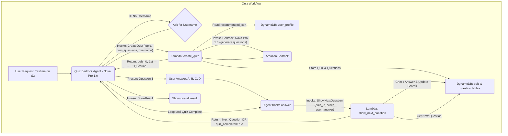

-----

# Knowledge Checker Agent (Quiz)

### 1\. Purpose of this Agent:

The **Knowledge Checker Agent** (named "Quiz") is an expert system designed to **create and administer mock AWS certification questions** to assess a user's preparation level. Its core purpose is to facilitate an interactive quiz workflow, track user performance on a question-by-question basis, and provide an overall result upon completion, thereby identifying the user's current knowledge against the target certification syllabus. 📝

-----

### 2\. Architecture Details:

#### Diagram (Corrected Mermaid Syntax)

#### How components interact

The **Quiz Bedrock Agent** orchestrates the entire assessment using the **Nova Pro 1.0** model.

1.  **Quiz Initiation**: The agent calls the **`create_quiz` Lambda** to start. This Lambda dynamically generates questions using **Nova Pro 1.0** via the **Bedrock Runtime**, and then stores the entire quiz (metadata and questions) in the **DynamoDB** tables.
2.  **Interactive Loop**: For every user answer, the agent calls the **`show_next_question` Lambda**. This Lambda validates the answer, updates the user's score in DynamoDB, and fetches the next question.
3.  **Quiz Completion**: The loop continues until the last question is processed. The `show_next_question` Lambda signals the end, and the agent then invokes the final **`ShowResult`** action group (inferred) to present the user's final performance summary.

#### Data Flow

The data flow is maintained through the **three DynamoDB tables**: `user_profile` (read-only for context), `quiz` (session metadata and total score), and `question` (per-question details and user performance). The agent's instructions ensure that the user's input is constantly tracked and updated in the respective tables.

-----

### 3\. AWS Services:

| Service | Component Name | Role and Function |
| :--- | :--- | :--- |
| **Amazon Bedrock** | **Quiz Agent (Nova Pro 1.0)** | The orchestrator and decision engine. The **Nova Pro 1.0** Foundation Model is used both for the agent's logic and is explicitly called by the `create_quiz` Lambda to dynamically **generate exam-style questions**. |
| **AWS Lambda** | **`create_quiz`** | Calls the Bedrock model to generate questions, formats the quiz, and stores the initial state in DynamoDB. |
| **AWS Lambda** | **`show_next_question`** | Validates user answers, manages the scoring logic, and controls the flow of questions by fetching the next one from DynamoDB. |
| **Amazon DynamoDB** | **`user_profile`, `quiz`, `question`** | **Persistent, highly scalable storage** for all quiz state, question content, and user scores, enabling the interactive, multi-turn conversation. |
| **AWS SDK (boto3)** | Included in Lambdas | Provides the necessary API calls to interact with **DynamoDB** (for state persistence) and **Bedrock Runtime** (for question generation). |

-----

### 4\. Deployment and infrastructure

  - **Required IAM roles/policies**:
      * **Bedrock Agent Execution Role**: Needs `lambda:InvokeFunction` permission for both `create_quiz` and `show_next_question` Lambdas.
      * **`create_quiz` Lambda Role**: Requires `dynamodb:PutItem`, `dynamodb:GetItem` (on relevant tables), and crucially, `bedrock-runtime:Converse` to call the Nova Pro model for question generation.
      * **`show_next_question` Lambda Role**: Requires `dynamodb:GetItem` and `dynamodb:UpdateItem` to check answers and update scores.
  - **Versioning**: All components must be versioned. **Lambda versions** and **Bedrock Agent aliases** should be used to manage deployment and ensure rollbacks are possible.

-----

### 5\. Security and compliance

  - **IAM roles and least privilege**: The roles are strictly scoped. For example, the `show_next_question` Lambda does not have permission to invoke the Bedrock model, minimizing the security risk.
  - **Compliance requirements?**: The use of AWS managed services (Lambda, DynamoDB) helps meet compliance standards. Data in transit (agent $\leftrightarrow$ Lambda) is secured by **TLS**, and user quiz data is secured at rest by DynamoDB's encryption.

-----

### 6\. Operational Documentation

  - **Logging (CloudWatch)**: Detailed logging is implemented via `print` statements in the Lambda functions, which are automatically sent to **CloudWatch Logs**. This captures critical events like **Nova Pro prompts/responses**, score updates, and error tracebacks.
  - **Monitoring (metrics, dashboard, alarms)**: **CloudWatch metrics** will monitor Lambda performance (duration, errors) and DynamoDB activity. **Alarms** should be set for high error rates (e.g., in the `create_quiz` Lambda) to quickly alert operations teams.
  - **Error handling and retries**: The Lambdas use robust `try-except` logic (specifically for `ClientError` and `JSONDecodeError`) and the `create_error_response` helper function to return standardized error messages, allowing the agent to provide a polite, non-technical explanation to the user.
  - **Backup?**: **DynamoDB Point-in-Time Recovery (PITR)** should be enabled for the `quiz` and `question` tables to ensure user progress data is not lost.
  - **Scaling and performance considerations?**: The serverless architecture scales automatically. The main performance consideration is the latency of the **Nova Pro 1.0** model call within `create_quiz`, which is mitigated by selecting a fast, high-end model. The interactive phase relies on fast, single-item lookups and updates in DynamoDB, ensuring quick response times.
