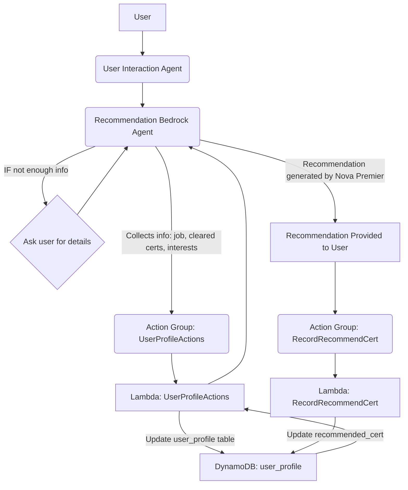

-----

# Recommendation Agent

### 1\. Purpose of this Agent:

The purpose of the **Recommendation Agent** is to provide personalized and relevant AWS certification recommendations to users. This is based on their individual attributes, such as their current job role, aspiring job role, cleared certifications, and areas of interest. The agent acts as a key component in guiding users toward a suitable learning path for professional development within the AWS ecosystem.

-----

### 2\. Architecture Details:

#### Diagram

#### How components interact

1.  **User Input**: A user sends a request to the system (e.g., "Recommend a cert for me").
2.  **Request Routing**: A **Bedrock Agent** (the **Recommendation Agent**) receives the request.
3.  **Information Gathering**: The agent, guided by its instructions, determines if it has enough information to make a recommendation. If not, it will ask the user for their job role, career goals, and interests.
4.  **Profile Update**: Once the information is collected, the agent invokes the **`UserProfileActions`** Lambda function (via an Action Group) to update the user's profile in the **DynamoDB** table.
5.  **Recommendation Generation**: The agent's logic, powered by **Nova Premier**, and with the updated user profile information, formulates a suitable certification recommendation.
6.  **Recommendation Recording**: After the recommendation is presented to the user, the agent invokes the **`RecordRecommendCert`** Lambda function (via an Action Group) to log the recommended certification in the user's DynamoDB profile.
7.  **Final Output**: The agent provides the recommendation to the user.

#### Data Flow

The data flows from the user, to the agent, which then invokes two separate **Lambda functions** that interact with a **DynamoDB** table. The first Lambda updates the user's profile with new information, while the second one records the recommended certification. This two-step process ensures a clean separation of concerns: updating the user's base information and logging the specific outcome of a recommendation.

#### Security Layers

Security is enforced using **IAM roles and policies**. The Bedrock Agent's execution role has a policy that grants it the minimal required permissions to invoke the specific Lambda functions (`UserProfileActions` and `RecordRecommendCert`). Each Lambda function's execution role has its own policy, allowing it to perform read and write operations on the designated DynamoDB table only. This multi-layered approach adheres to the **principle of least privilege**, and all data is secured with TLS in transit and encrypted at rest using **KMS** in DynamoDB.

-----

### 3\. AWS Services:

#### Lambda function

The solution relies on two Lambda functions:

  - **`UserProfileActions`**: This function is triggered by the agent and is responsible for writing user-provided data (e.g., job role, interests, cleared certifications) to the **`user_profile` DynamoDB** table. The function's code handles parameter extraction, validation, and updating the item in the table using `UpdateExpression` and `ExpressionAttributeValues`.
  - **`RecordRecommendCert`**: This function is triggered after the recommendation is given. Its sole purpose is to update the `recommended_cert` field for a specific user in the `user_profile` table. It also validates the presence of a `username` and `recommended_cert` before performing the update.

#### API Gateway

While not directly shown in the Lambda code, an **API Gateway** could be used to expose the Lambda functions as REST endpoints, which the Bedrock Agent would then call. This adds an additional layer of security, management, and control over the requests.

#### DynamoDB

**DynamoDB** serves as the central **user profile data store**. The `user_profile` table uses a primary key (e.g., `username`) and stores attributes like `currentjobrole`, `aspiringjobrole`, `clearedcertifications`, `interestareas`, and `recommended_cert`. The Lambda functions interact with this table to ensure the user's profile is always up-to-date and that recommendation history is recorded.

-----

### 4\. Deployment and infrastructure

  - **Required IAM roles/policies**:
      - **Bedrock Agent Execution Role**: Grants the agent permission to invoke the `UserProfileActions` and `RecordRecommendCert` Lambda functions.
      - **Lambda Execution Roles**: Two separate roles for each Lambda function. The roles will have policies granting them permission to **read from and write to the `user_profile` DynamoDB** table only.
  - **Versioning**: All components, including the Lambda functions and the Bedrock Agent configuration, should be versioned. **Lambda aliases** and Bedrock Agent aliases can be used to manage different environments (e.g., development, production) and facilitate seamless updates.

-----

### 5\. Security and compliance

  - **IAM roles and least privilege**: The architecture is designed with the **principle of least privilege** in mind. Each component is granted only the permissions it needs to perform its task, minimizing the potential attack surface.
  - **Compliance requirements?**: The use of managed services like **DynamoDB** and **Lambda** simplifies compliance by leveraging their built-in security features, such as encryption at rest and in transit.

-----

### 6\. Operational Documentation

  - **Logging (CloudWatch)**: Both Lambda functions are configured to send their logs to **Amazon CloudWatch Logs**. The provided code includes `print` statements that will be captured by CloudWatch, allowing for detailed debugging and monitoring of function invocations, parameter extraction, and DynamoDB operations.
  - **Monitoring (metrics, dashboard, alarms)**: **CloudWatch metrics** for Lambda (e.g., invocations, errors, duration) and DynamoDB (e.g., consumed read/write capacity units, latency) can be used to monitor the system's performance. **CloudWatch Alarms** can be set to notify of issues like a high error rate, and a dashboard can provide a consolidated view of the application's health.
  - **Error handling and retries**: The provided Lambda code includes comprehensive error handling using `try-except` blocks, specifically for `ClientError` from boto3. This ensures that a proper error message and status code are returned in case of issues like a non-existent user or DynamoDB errors. The agent itself can be configured to handle these error codes and provide a graceful response to the user.
  - **Backup**: DynamoDB **Point-in-Time Recovery (PITR)** can be enabled on the `user_profile` table to protect the data from accidental deletion or corruption.
  - **Scaling and performance considerations**: The serverless nature of **Lambda** and **DynamoDB** ensures the system scales automatically to handle varying loads. This eliminates the need for manual capacity provisioning and ensures a consistent, low-latency experience for users.

